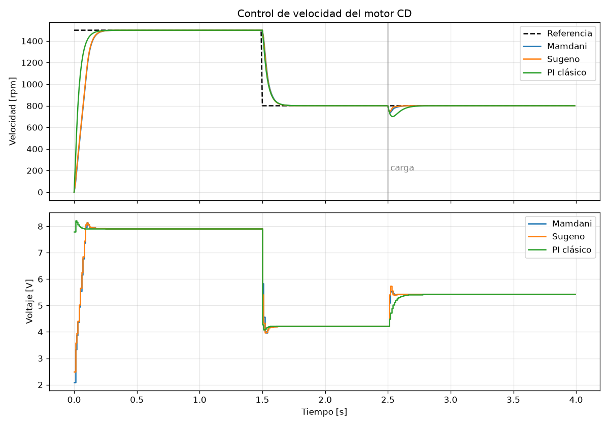

# Controlador difuso para motor CD

Control de **velocidad** de un motor CD con lógica difusa.

- **Fase A (U1):** sistema de inferencia difusa (Mamdani y Sugeno) y simulación del motor en Python.
- **Fase B (U2):** el mismo controlador corriendo en un **ESP32** con puente H, en modo HIL y con el motor real.

## Estructura

```
fase_a/
  fuzzy.py            Motor de inferencia difusa hecho a mano (sin librerías)
  controlador.py      Reglas, ganancias y controlador difuso PI incremental (+ PI clásico)
  motor_dc.py         Modelo físico del motor (RK4)
  simular.py          Lazo cerrado, métricas y pruebas de robustez
  superficie.py       Funciones de pertenencia, superficies y ejemplo paso a paso
  test_controlador.py Pruebas automáticas (python -m unittest)
  resultados/         Gráficas generadas
fase_b/
  esp32_fuzzy/esp32_fuzzy.ino   Firmware (Arduino IDE)
  hil_planta.py       HIL: ESP32 = controlador, PC = motor simulado (lo que usamos)
  prueba_motor.py     Solo si consiguen sensor: identificación y lazo cerrado real
GUIA_DEFENSA.md       Preguntas probables y respuestas (¡todos deben leerla!)
USO_IA.md             Declaración de uso de IA
```

## Cómo correrlo

```bash
pip install -r requirements.txt
cd fase_a
python -m unittest -v      # 10 pruebas
python simular.py          # tabla de métricas + gráficas
python superficie.py       # superficies + inferencia paso a paso
```

## Diseño del controlador

**Tipo:** difuso PI incremental, con 2 entradas y 1 salida.

| Señal | Definición | Escala (normaliza a [-1, 1]) |
|---|---|---|
| e  | ref − rpm | Ke = 1 / (0.20·RPM_MAX) |
| de | e_k − e_(k−1) | Kde = 1 / (0.066·RPM_MAX) |
| du | salida del FIS | Kdu = 2.5 V por periodo |

u_k = sat(u_(k−1) + du_k) con límite de ±12 V y periodo Ts = 10 ms.

- **Conjuntos:** 5 triángulos por variable (NG, NP, Z, PP, PG) con 50 % de traslape. Los de los extremos son hombros.
- **Reglas:** tabla de 5×5 (MacVicar-Whelan) con una diagonal de equilibrio en `Z`.
- **Mamdani:** AND = min, implicación = min, agregación = max, defuzzificación por centroide.
- **Sugeno (orden 0):** las salidas son singletons en −1, −0.5, 0, 0.5 y 1, y se combinan con un promedio ponderado.

## Resultados de simulación (modelo nominal)

| | Sobrepaso | t. subida | t. establ. (2 %) | Error final | Caída con carga |
|---|---|---|---|---|---|
| Mamdani | 0 % | 0.12 s | 0.19 s | 0 rpm | 65 rpm |
| Sugeno  | 0 % | 0.11 s | 0.19 s | 0 rpm | 54 rpm |
| PI clásico | 0 % | 0.08 s | 0.15 s | 0 rpm | 101 rpm |

**Robustez, sin volver a sintonizar:**

| Cambio en el motor | Sobrepaso Mamdani | Sobrepaso Sugeno | Sobrepaso PI |
|---|---|---|---|
| J ×2 | 0.6 % | 0.6 % | 8.8 % |
| R +50 % | 0 % | 0 % | 3.6 % |
| K −20 % | 0 % | 0 % | 5.4 % |

**Conclusión honesta:** con el modelo nominal el PI es más rápido. Los difusos rechazan mejor la carga y casi no cambian cuando varían los parámetros del motor. Con ruido de 15 rpm, Sugeno reacciona más que Mamdani, porque cerca de cero su superficie es más inclinada.



## Fase B: ESP32

### Conexiones (por defecto)

| ESP32 | Destino |
|---|---|
| GPIO25 | ENA (PWM) del L298N |
| GPIO26 / GPIO27 | IN1 / IN2 |
| GPIO32 / GPIO33 | Encoder A / B (opcional, 3.3 V) |
| GND | GND común entre el ESP32 y el puente H |

> Si usan un L298N, quiten el jumper de ENA para que el pin reciba el PWM.

### Nuestro caso: sin sensor → HIL con el motor físico

No tenemos encoder, así que el ESP32 no puede medir la velocidad real. La Fase B se hace en **HIL**:

- el **controlador difuso** corre en el ESP32;
- la **velocidad** la calcula el modelo del motor en la PC;
- el **voltaje** que decide el controlador también se aplica al motor físico (`MOTOR_SIGUE_HIL = true`), así que se ve reaccionar en vivo.

```
PC (modelo del motor) --y rpm--> ESP32 (FIS Mamdani/Sugeno) --u volts--> PC
                                         |
                                         +--PWM--> puente H --> motor físico (demo visual)
```

**Qué se ve en el motor:** arranca fuerte, baja de velocidad en t = 1.5 s y en t = 2.5 s "empuja" más (sube el voltaje) para compensar la carga simulada.

**Qué no se puede afirmar:** que se controla la velocidad real del motor. El motor físico sigue al motor simulado en lazo abierto. Díganlo así en la defensa.

### Pasos

1. Abran `esp32_fuzzy.ino` en Arduino IDE (placa "ESP32 Dev Module"). Dejen `HAY_SENSOR = false` y `RPM_MAX = 2274.0`, y súbanlo.
2. Cierren el Monitor Serie (ocupa el puerto) y corran:
   ```bash
   python fase_b/hil_planta.py --puerto COM7 --metodo mamdani
   ```
   ```bash
   python fase_b/hil_planta.py --puerto COM7 --metodo sugeno
   ```
   La curva del HIL debe coincidir con la simulación. Eso demuestra que el FIS embebido está bien implementado. El CSV y la gráfica se guardan en `fase_b/resultados/`.
3. Para probar el puente H a mano, desde el Monitor Serie: `v6` (6 V en lazo abierto), `v-6` (sentido inverso), `p` (paro). Con `m`, `s` o `i` se elige Mamdani, Sugeno o PI.

Por seguridad, si el script de la PC se cierra a medio HIL, el ESP32 apaga el motor a los 300 ms.

### Interfaz gráfica (todo desde una ventana)

```bash
python fase_b/interfaz.py
```

- **Conexión:** elegir el puerto y presionar *Conectar*. Antes, cierren el Monitor Serie de Arduino.
- **Modo:** *Simulación* (solo PC) o *HIL* (ESP32 + motor físico).
- **Controlador:** Mamdani, Sugeno o PI clásico. El PI está en Python y en el firmware (comando `i`), solo para comparar contra el difuso; funciona en simulación y en HIL.
- **Escenario:** las dos referencias, cuándo cambia, cuándo entra la carga y cuánta carga.
- **Comparar todos los métodos:** corre uno tras otro y los encima en la misma gráfica, con su tabla de métricas.
- **Motor manual:** un deslizador de −12 a 12 V para mover el motor en lazo abierto.
- **Guardar resultados:** guarda la gráfica (PNG) y los datos (CSV) en `fase_b/resultados/`.

### Si luego consiguen un sensor (lazo cerrado real)

Un sensor óptico de ranura (FC-03 / MOCH22A) con un disco de cartón con ranuras, o un TCRT5000 con una marca en el eje, cuesta muy poco. Con él:

1. Pongan `HAY_SENSOR = true` y `ENCODER_UN_CANAL = true`, y en `PULSOS_POR_VUELTA` el número de ranuras.
2. **Identificar el motor real:**
   ```bash
   python fase_b/prueba_motor.py identificar --puerto COM7 --voltaje 12
   ```
   El script imprime el valor de `RPM_MAX`. Pónganlo en el firmware. Si el motor no arranca con voltajes bajos, midan ese voltaje mínimo y pónganlo en `ZONA_MUERTA_V`.
3. **Lazo cerrado real:**
   ```bash
   python fase_b/prueba_motor.py lazo --puerto COM7 --metodo mamdani --ref1 200 --ref2 120
   ```
   Repitan con `--metodo sugeno`. Durante la prueba pueden frenar el eje con los dedos para mostrar la perturbación.

## Equipo

| Integrante | Módulo principal |
|---|---|
| 1 | `fuzzy.py`, `superficie.py` |
| 2 | `motor_dc.py`, `simular.py`, pruebas |
| 3 | Firmware ESP32 y electrónica |
| 4 | `hil_planta.py`, `prueba_motor.py`, documentación |

Aunque cada quien tiene su módulo, **todos** deben poder explicar todo (ver `GUIA_DEFENSA.md`).
